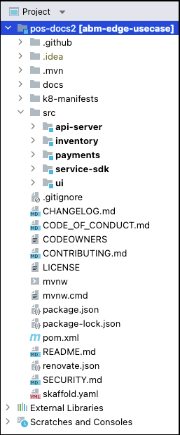
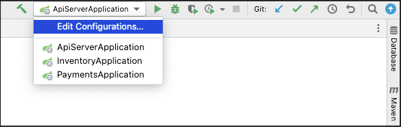
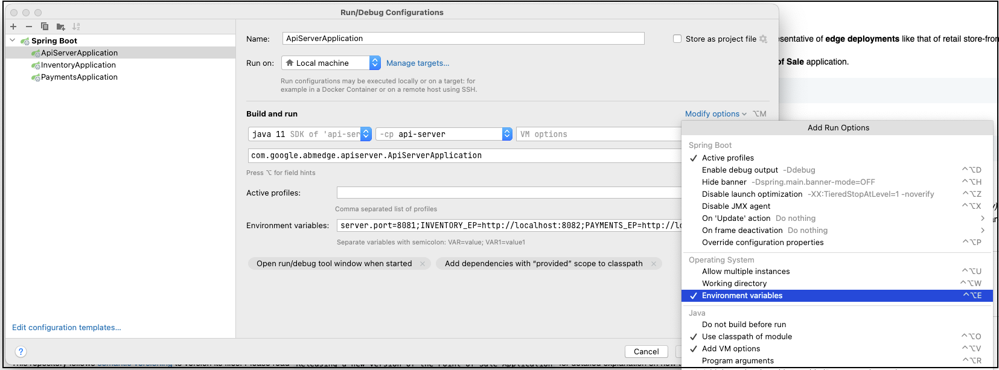
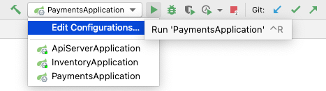
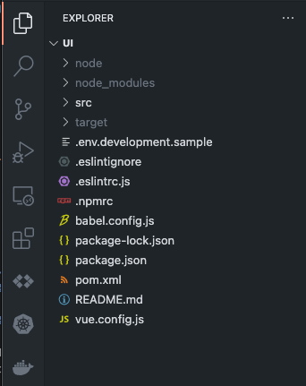

# Local development whilst running everything locally

When running the whole application stack locally, there are two setup steps.
- [Run the **Java Springboot** based API services](#run-the-java-springboot-based-api-services)

- [Run the **NodeJS VueJS** based UI service](#run-the-nodejs-vuejs-based-ui-service)
---

### Run the **Java Springboot** based API services

The steps below assumes that the IDE used is [IntelliJ IDEA](https://www.jetbrains.com/idea/). However, it must be possible to replicate the same setup on another IDE _(e.g. VSCode)_ with some changes.

### Steps

- **Open the cloned project in IntelliJ IDEA**

    This should automatically trigger the IDE to identify the [`root pom.xml`](/pom.xml)
    file and load all the maven projects under [`src`](/src/). If those projects
    were identified and properly loaded, then you should see them bolded as shown
    below:
    <p align="center">
        
        <div align="center">
            <strong>(click to enlarge)</strong>
        </div>
    </p>

    IntelliJ will also identify them as `Springboot Projects` automatically and
    setup `Run configurations` for the three services: _api-server, inventory and payments_.

    <p align="center">
        
        <div align="center">
            <strong>(click to enlarge)</strong>
        </div>
    </p>

  - **Set environment variables for the services**

      To be able to run the services locally we must update the `Run configurations`
      with some additional parameters. These values are passed in to the services as
      `Config Map Values` in the K8s cluster based setup.

    - Click on `Edit Configurations` _(see image above)_ from the top right menu
    - In the window that pops up, set the following `Environment Variables` for
        the three different services. If you don't see an option to fill in
        environment variables, you can enable it from the `Modify options` dropdown.

        <p align="center">
            
            <div align="center">
                <strong>(click to enlarge)</strong>
            </div>
        </p>

      | Service               | Variable Key      | Variable Value                                                                                                                                                                                                                                                                                                                                                                                                                                                                                                                                                                                                                                                     |
      |---------              |--------------------------------------------------------------------------------------------------------------------------------------------------------------------------------------------------------------------------------------------------------------------------------------------------------------------------------------------------------------------------------------------------------------------------------------------------------------------------------------------------------------------------------------------------------------------------------------------------------------------------------------------------------------------|----------------           |
      | ApiServerApplication  | server.port       | 8081                                                                                                                                                                                                                                                                                                                                                                                                                                                                                                                                                                                                                                                               |
      | PaymentsApplication   | server.port       | 8083                                                                                                                                                                                                                                                                                                                                                                                                                                                                                                                                                                                                                                                               |
      | InventoryApplication  | server.port       | 8082                                                                                                                                                                                                                                                                                                                                                                                                                                                                                                                                                                                                                                                               |
      | ApiServerApplication  | INVENTORY_EP      | http://localhost:8082                                                                                                                                                                                                                                                                                                                                                                                                                                                                                                                                                                                                                                              |
      | ApiServerApplication  | PAYMENTS_EP       | http://localhost:8083                                                                                                                                                                                                                                                                                                                                                                                                                                                                                                                                                                                                                                              |
      | InventoryApplication  | ACTIVE_ITEM_TYPE  | burgers                                                                                                                                                                                                                                                                                                                                                                                                                                                                                                                                                                                                                                                            |
      | InventoryApplication  | ITEMS             | "items:\n- name: "BigBurger"\n  type: "burgers"\n  price: 5.50\n  imageUrl: "usr/lib/images/bigburger.png"\n  quantity: 200\n  labels: [ "retail", "restaurant", "food" ]\n- name: "DoubleBurger"\n  type: "burgers"\n  price: 7.20\n  imageUrl: "usr/lib/images/burgers.png"\n  quantity: 200\n  labels: [ "retail", "restaurant", "food" ]\n- name: "Shirt"\n  type: "textile"\n  price: 15.50\n  imageUrl: "usr/lib/images/shirt.png"\n  quantity: 50\n  labels: [ "retail", "textile", "clothing" ]\n- name: "Short"\n  type: "textile"\n  price: 17.20\n  imageUrl: "usr/lib/images/short.png"\n  quantity: 20\n  labels: [ "retail", "textile", "clothing" ]" |

      Also set the environment variable `ITEMS` for the `InventoryApplication` service to:
      ```shell
      items:\n- name: "BigBurger"\n  type: "burgers"\n  price: 5.50\n  imageUrl: "usr/lib/images/bigburger.png"\n  quantity: 200\n  labels: [ "retail", "restaurant", "food" ]\n- name: "DoubleBurger"\n  type: "burgers"\n  price: 7.20\n  imageUrl: "usr/lib/images/burgers.png"\n  quantity: 200\n  labels: [ "retail", "restaurant", "food" ]\n- name: "Shirt"\n  type: "textile"\n  price: 15.50\n  imageUrl: "usr/lib/images/shirt.png"\n  quantity: 50\n  labels: [ "retail", "textile", "clothing" ]\n- name: "Short"\n  type: "textile"\n  price: 17.20\n  imageUrl: "usr/lib/images/short.png"\n  quantity: 20\n  labels: [ "retail", "textile", "clothing" ]
      ```

- **Run all three applications from the IDE**
    <p align="center">
        
        <div align="center">
            <strong>(click to enlarge)</strong>
        </div>
    </p>
---
### Run the **NodeJS VueJS** based UI service

The steps below assumes that the IDE used is [VSCode](https://code.visualstudio.com/).
However, it must be possible to replicate the same setup on another IDE
_(e.g. IntelliJ)_ with some changes.

> Make sure your node version is **">=16.13.2 and <17"**

### Steps

- **Open the `src/ui` folder of the cloned project in VSCode**
    <p align="center">
        
        <div align="center">
            <strong>(click to enlarge)</strong>
        </div>
    </p>

- **Create a local development environment config file**

  We create a `.env.development.local` file and provide `IP_ADDRESS` of the API
  server to use during local development. So in this case we use `localhost:8081`
  as the `IP_ADDRESS` of the API server as configured earlier.

  > Make sure to run the following commands from the root directory of the repository
  ```sh
  API_SERVER_IP=localhost:8081
  sed "s/IP_ADDRESS/$API_SERVER_IP/g" src/ui/.env.development.sample > src/ui/.env.development.local
  ```

  The above would have created a file called `.env.development.local` under `src/ui`.
  It contents should be as follows:
  ```sh
  VUE_APP_API_SERVER_URL='http://localhost:8081'
  ```

- **Install the required dependencies**
  ```sh
  npm install --prefix src/ui
  ```

- **Run the UI application**
  ```sh
  npm run serve --prefix src/ui
  ```
    ```sh
    # expected output
    > ui@0.1.0-SNAPSHOT serve
    > npm run lint && vue-cli-service serve


    > ui@0.1.0-SNAPSHOT lint
    > vue-cli-service lint

    DONE  No lint errors found!
    INFO  Starting development server...


    DONE  Compiled successfully in 5197ms                                                                                                                                                                                                                         5:42:07 p.m.


    App running at:
    - Local:   http://localhost:8080/
    - Network: unavailable

    Note that the development build is not optimized.
    To create a production build, run npm run build.
    ```

You may now access the application by visiting `http://localhost:8080/` in a
browser. As you make changes to the UI you should be able to see those take
effect on the browser with a simple refresh. In order for changes to the Java
services to take effect, you must restart the service that was changed.