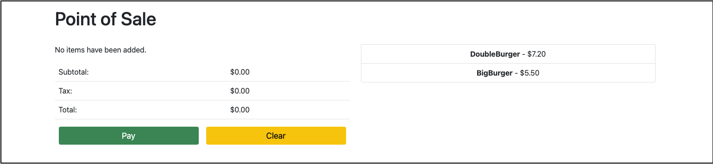

## Deploy the application to a cluster

### Prerequisites

- [gcloud CLI](https://cloud.google.com/sdk/docs/install)
- [kubectl CLI](https://kubernetes.io/docs/tasks/tools/)
- [skaffold CLI](https://skaffold.dev/docs/install/)

---

### Steps

1. **[Create a Google Cloud Platform project](https://cloud.google.com/resource-manager/docs/creating-managing-projects#creating_a_project)**
   or use an existing project. Set the `PROJECT_ID` environment variable and
   ensure the Google Kubernetes Engine and Cloud Monitoring APIs are enabled.

    ```bash
    export PROJECT_ID="<your-project-id>"
    gcloud services enable \
      container.googleapis.com \
      monitoring.googleapis.com \
      --project ${PROJECT_ID}
    ```
2. **Clone this repository.**
    ```bash
    git clone https://github.com/GoogleCloudPlatform/point-of-sale.git
    cd point-of-sale
    ```

3. **Create a GKE cluster.**
    ```bash
    export CLUSTER_NAME=pos-cluster
    export ZONE=us-central1-b
    gcloud container clusters create $CLUSTER_NAME \
        --project=${PROJECT_ID} \
        --zone=${ZONE} \
        --machine-type=e2-standard-2 \
        --num-nodes=2
    ```

4. **Deploy the sample app to the cluster.**
    ```bash
    # generate the release kubernetes manifests
    skaffold render -p release > pos-quickstart.yaml
   
    # apply the yaml files to the cluster
    kubectl apply -f pos-quickstart.yaml
    ```

5. **Wait for the Pods to be ready.**
    ```bash
    kubectl wait --for=condition=available --timeout=600s deployment --all
    ```

   ```bash
   # expected output
   + kubectl wait --for=condition=available --timeout=600s deployment --all
   deployment.apps/api-server condition met
   deployment.apps/inventory condition met
   deployment.apps/payments condition met
   ```

6. **Access the Point of Sale application** using the `EXTERNAL_IP` of the API
   Server `Service`.
   ```bash
   kubectl get service/api-server-lb -o jsonpath={.status.loadBalancer.ingress[0].ip}
   ```
   ```bash
   # expected output (you will see a different IP address)
   35.238.98.46
   ```
   <p align="center">
     
   </p>

   > **Note**- you may see `<pending>` while GCP provisions the Loadbalancer. If
   this happens, wait a few minutes and re-run the command.

7. [Optional] **Clean up**:
   ```bash
   gcloud container clusters delete $CLUSTER_NAME \
      --project=${PROJECT_ID} \
      --zone=${ZONE}
   ```
